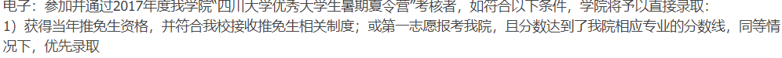

# 通信工程2015级林龙晋-四川大学信息与通信工程

|姓名|专业|年级|推免院校|推免专业|
|:-|:-|:-|:-|:-|
|林龙晋|通信工程|2015级|四川大学|信息与通信工程|

联系邮箱: `291784673@qq.com`

## 自我介绍

本人2015级通信工程学生林龙晋，研究生阶段将在四川大学电子信息学院的信通专业继续深造。目前对选择的导师比较满意，导师也已经布置了一些学习任务让我去完成。在此我分享一下自己保研的经历，谈不上经验，因为我是在学院推免公示文件下发后才意识到自己拥有保研资格（囧），也从未在此之前了解保研的相关信息（一根筋地觉得自己保不了研，傻了吧唧地以为通信专业固定只有四个名额，还不去问学长学姐），可以说是个活生生的反面教材（是真的蠢），也希望学弟学妹们引以为戒吧。

## 保研经验

如果是铁了心打算保研的，首先最重要的就是要保证成绩好（废话），大三的成绩尤其重要，因为大三是决定保研名额的最后一年，尤其是通信专业（大三是通信专业课最多的一年，多到大三下考试周一天考三门），学得好的大三拉分会很多，学得差的就看着自己的排名往下掉吧（没错就是我）。课一定要认真听，早点去教室抢前排座，不要觉得自己坐哪里都行，前排的听课效率真的高很多。也不要课上不听课后自己看书补内容（还是我），老师讲课都有侧重点，课上能学的放在课后学浪费时间不说，效率还很低。

大三的时侯我是想着好好刷成绩的，因为大一大二的成绩排名一直在保研名额的边缘徘徊，想的是先把成绩搞好然后再考虑保研的事。然后到了大三下最后一门考试结束的时候我就万念俱灰了，考的实在是太！烂！了！ 原因就是课上听不进去，课后自己又补不回来，最后复习看着小山一样的书实在是看不完（希望学弟学妹们上课认真听讲）。由于我一直“迷信”保研名额是四个，直接放弃保研的想法，导致我对夏令营和九推都是0准备（是真的蠢！）。本来也有考研打算，假期回家和父母商量后被他们说服去考公务员（他们一直希望我考公）。所以假期期间一直到开学初我都在做考公的准备。

直到9月13号晚上学院推免文件下来了我看了好几遍后终于欣喜若狂，才开始准备联系导师（是真的真的太迟了），不是都说咱们学院川大重大好去嘛，一开始就想着先看看能不能拿个offer保底，打开重大研究生招生网一看，哦豁，已经截止报名了？再去川大的计院官网一看（认识一个学长在川大计院），哦豁，也截止报名了？当时就急了，担心很多学校都已经截止报名，而我连导师都没联系上，匆忙下赶紧写了封联系信，再三思量没有群发，先进学校官网看了看想投的老师的研究方向，并且粗略浏览下老师发表的论文后大致改动了自己的信再发送，总之最后投了六、七个老师的邮箱。到了14号整个白天过去了都没有收到消息，当时心里更急，想着干脆破罐破摔打电话好了，不过终于在晚上的时候联系上了湖南大学的一位老师，通知我走流程填系统参加推免生复试，当时心就稍微放松些了。后面几天也陆续有老师给回复，我也一一交流，总之在通过复试后最终经过考虑后我选择了川大的一位老师。

以上算是大致个人经历了，一些细节我当做个人经验写在下面。

1. 如果有哪个学弟学妹成绩在保研资格的边缘的，大三不确定自己有没有名额，也先把导师联系了（联系迟了导师就已经没有研究生名额了，比如我投了两个电科大的老师，都没有回应，估计是满了）、把夏令营报了（别像我这么蠢…）。就算没有保研资格，有些学校对夏令营通过的学员考研也有降分录取的条件（比如说川大2017年时就有，据说电科大也有），附张图：

2. 听说川大夏令营今年几乎不刷人。

3. 如果前三年成绩排名出来了没有保研资格，又不打算考的话，可以去试试我们学校医学院（最近几年新成立）医学信息工程专业的保研，今年有3个名额，基本是我们学院和计院报，要通过面试考核。

4. 大部分的推免复试都是面试，有些学校可能有笔试加面试（比如电科大的有个实验室要考通信原理），面试中一般会有英文面试（实际上就是英文自我介绍，提前准备很简单），一些学校支持网络面试（比如说湖南大学），不过我还是觉得直接现场面试效果好些。

5. 大学期间还是有点奖比较好，不然面试问一句本科都做了什么感觉会很难答…… 简历也会没啥内容。我的复试就是依据简历上的奖问了我一些问题，比如说XX数模比赛解决啥问题，里面的XX算法作用是啥，或是XX电设你们设计了什么、怎么实现之类的问题，由于都是自己做过的东西，答起来就很简单，也容易获得老师认可。面试时还会问点专业问题（很简单）。

6. 尽量还是通过英语六级比较好，我回答一个导师六级成绩（就比425多十几分）的时候，感觉导师是有点嫌弃的… 没过六级的话感觉会被他鄙视……

7. 说说川大电子信息学院的复试，我投了导师的邮箱后来他就直接打电话给我了（当时吓到了），详细地问我简历上的奖项内容，还问了个随机信号的小问题（我没答出来……），问完了说了句可以收我就挂了（我：？？？），后来才知道这通电话就算是川大电子信息学院的推免复试了（感觉有点水），倒挺方便，不用跑学校。

8. 如果通过复试了并且确定选哪个导师了还是要和其他导师回个拒绝信，越早越好，不然占着坑到填推免系统那天再鸽了其他导师会很难受，这一点也不好。早点发拒绝信不用怕其他导师怎么想，研究生导师见多了。今年的推免比例是5.6%，可以依据这个算算推免人数，今年算法是四舍五入的，我们专业81人算下来4.54就是5个人（比例少0.1%或是专业少一人我就拿不到了，还是很幸运的），一般学院会有递补名额（就是按推免比例算完后学院还多了一个名额），但是递补很难，今年只有一个递补名额，电信和电科专业分配（因为他们专业人数稍微多一点？不太清楚为什么）。

9. 今年的推免比例是5.6%，可以依据这个算算推免人数，今年算法是四舍五入的，我们专业81人算下来4.54就是5个人（比例少0.1%或是专业少一人我就拿不到了，还是很幸运的），一般学院会有递补名额（就是按推免比例算完后学院还多了一个名额），但是递补很难，今年只有一个递补名额，电信和电科专业分配（因为他们专业人数稍微多一点？不太清楚为什么）。

嗯……想说的就这么多，总之经过推免，我蛮喜欢现在的研究生导师的，未来实验室条件也不错，现在也在看他发给我的一些论文。也欢迎学弟学妹们以后研究生阶段也来川大的电子信息学院（当然有条件想去好学校感觉还是电科大西电和北邮吧），我经验说的不多（因为9月中旬才开始准备九推，关于怎么选导师怎么发联系信之类的我也不讲了），想了解更详细的经验就去看朱桐（大神）的分享。总之看过这些经验，我应该会是我们学院最后一个推免工作做的这么差的了（哭泣）。
